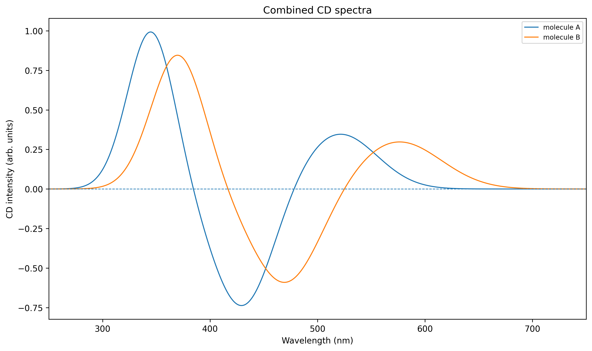
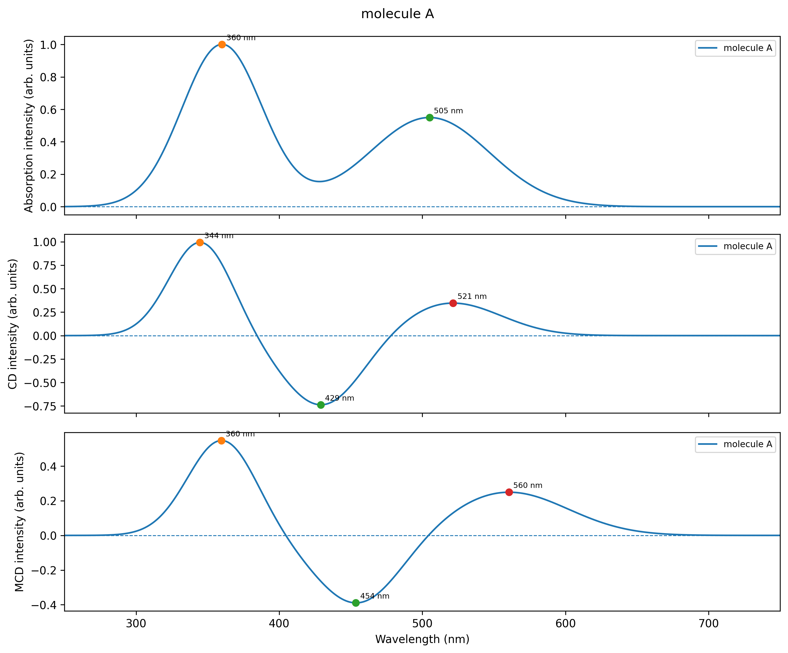

# ORCA Spectroscopy Tools

[](https://github.com/shadram87/orca-spectroscopy-tools/actions/workflows/tests.yml)
[](https://www.python.org/)
[](LICENSE)

A small scientific Python toolkit for post-processing spectrum files produced
by **ORCA** and the **`orca_mapspc`** utility. It is designed for computational
absorption, circular dichroism (CD), and magnetic circular dichroism (MCD)
workflows.

The project grew from research scripts used to compare molecular and
molecule–surface spectra. The code has been reorganized into a tested package
with a command-line interface and reusable analysis functions.

> This is an independent research utility and is not an official ORCA project.
> ORCA itself is distributed separately by FACCTs.

## Features

- read two-column ORCA/`orca_mapspc`-style text files, with or without headers;
- convert wavenumber (cm⁻¹) to wavelength (nm);
- plot multiple absorption, CD, or MCD spectra together;
- detect positive maxima and negative minima;
- export extrema to a machine-readable CSV report;
- subtract a surface/background MCD spectrum from a hybrid spectrum;
- safely interpolate spectra generated on different wavelength grids;
- create aligned absorption–CD–MCD panel figures;
- export figures as SVG, PNG, or PDF;
- run automated tests on multiple Python versions.

## Installation

Python 3.10 or newer is recommended.

```bash
python -m venv .venv
```

Activate the environment:

```bash
# Linux/macOS
source .venv/bin/activate

# Windows PowerShell
.venv\Scripts\Activate.ps1
```

Install the package:

```bash
pip install -e .
```

For development and tests:

```bash
pip install -e ".[dev]"
```

## Supported input

The first two numerical columns are interpreted as horizontal coordinate and
intensity. Additional columns are currently ignored.

Typical raw `orca_mapspc`-style file:

```text
# Wavenumber (cm-1)   Intensity
20000.0               0.0012
21000.0              -0.0034
```

Recognized filename endings include:

```text
molecule.abs.dat
molecule.cd.dat
molecule.mcd.dat
molecule.abs.nm.dat
molecule.cd.nm.dat
molecule.mcd.nm.dat
```

When `--x-unit auto` is used, filenames containing `.nm.` are treated as
wavelength data. Otherwise, values typical of UV/visible wavenumbers are
converted from cm⁻¹ to nm.

## Command-line examples

### Plot all spectra in a directory

```bash
orca-spectra plot examples/input \
  --output-dir examples/output \
  --wavelength-min 250 \
  --wavelength-max 750 \
  --find-peaks
```

Process selected spectrum types only:

```bash
orca-spectra plot data --types cd mcd --formats svg png pdf
```

Write converted `.nm.dat` files:

```bash
orca-spectra plot data --write-converted
```

### Subtract an MCD background

```bash
orca-spectra subtract \
  hybrid.mcd.nm.dat \
  silver_surface.mcd.nm.dat \
  --output reaction_mcd.nm.dat \
  --plot
```

The reference is interpolated onto the sample wavelength grid inside their
shared interval before subtraction.

### Create an absorption–CD–MCD panel

```bash
orca-spectra panel \
  --abs molecule.abs.dat \
  --cd molecule.cd.dat \
  --mcd molecule.mcd.dat \
  --output results/molecule_panel \
  --mark-peaks
```

View all options:

```bash
orca-spectra --help
orca-spectra plot --help
```

## Example output

### Combined CD spectra



### Absorption–CD–MCD panel



## Project structure

```text
orca-spectroscopy-tools/
├── src/orca_spectroscopy_tools/
│   ├── analysis.py
│   ├── cli.py
│   ├── io.py
│   └── plotting.py
├── tests/
├── examples/
├── docs/
├── pyproject.toml
└── README.md
```

## Tests

```bash
pytest
ruff check .
```

GitHub Actions runs the same checks on Python 3.10–3.13.

## Scope and roadmap

The current release focuses on one-dimensional UV/visible absorption, CD, and
MCD data. Planned extensions include:

- direct parsing of selected ORCA excited-state tables;
- support for `orca_mapspc` stick spectra;
- transition-to-band correlation tools;
- configurable normalization and spectral broadening;
- additional publication-figure templates.

## ORCA reference

For the format and capabilities of `orca_mapspc`, consult the official ORCA
manual:

- https://www.faccts.de/docs/orca/6.1/manual/contents/utilitiesvisualization/utilities.html

## License

MIT License. See [LICENSE](LICENSE).
